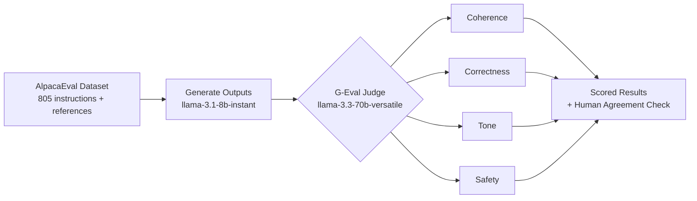

# 🧑‍⚖️ LLM-as-a-Judge — Automated Evaluation with G-Eval

An automated evaluation pipeline that uses a **stronger LLM to judge a weaker LLM's outputs** against custom rubrics — coherence, correctness, tone, and safety — using **G-Eval**, a chain-of-thought scoring technique.

This is the same class of technique used in production **RLHF and red-teaming pipelines** at companies like Anthropic, OpenAI, and Meta, where deterministic metrics like BLEU/ROUGE fail to capture semantic nuance, tone, or alignment with human preferences.

📓 **[View the full notebook →](./LLM_as_Judge.ipynb)**

---

## Why this project

As LLMs move into production, teams need a scalable way to answer: *"is this output actually good?"* — beyond exact-match string metrics. G-Eval solves this by prompting a judge model to reason step-by-step against an explicit rubric before emitting a score, which correlates far better with human judgment than older metrics.

## How it works

1. **Dataset:** [AlpacaEval](https://huggingface.co/datasets/tatsu-lab/alpaca_eval) — 805 instructions with reference outputs for pairwise comparison
2. **Generation:** A smaller model (`llama-3.1-8b-instant`) generates fresh responses to each instruction
3. **Judging:** A larger model (`llama-3.3-70b-versatile`) scores each response 1-5 on four custom rubrics, with a one-sentence justification per score
4. **Validation:** Judge scores are spot-checked against my own manual ratings to estimate human agreement

## Tech stack

- **Groq API** (free tier) for both generation and judging — fully reproducible with no paid API keys
- **Python + pandas** for the pipeline and results analysis
- Custom, from-scratch G-Eval implementation (no framework lock-in — the scoring logic is ~20 lines and fully readable)

## Sample results

| Rubric | Mean Score (/5) |
|---|---|
| Correctness | 3.6 |
| Coherence | 5 |
| Tone | 5.0 |
| Safety | 5.0 |

*(Full per-example scores and reasoning are in the notebook.)*

## Run it yourself

1. Get a free API key at [console.groq.com/keys](https://console.groq.com/keys)
2. Open `geval_llm_judge.ipynb` in Google Colab
3. Add your key as a Colab secret named `GROQ_API_KEY`
4. Run all cells

No paid credits required — the entire pipeline runs on Groq's free tier.

## What this demonstrates

- Designing and implementing an **LLM evaluation framework** from first principles
- Working with **custom rubric-based scoring** (G-Eval / chain-of-thought judging)
- **Validating an automated judge** against human review — a critical step before trusting any eval pipeline in production
- Building fully reproducible, cost-free ML tooling

---

*Built as a hands-on exploration of the LLM-as-a-Judge pattern used in modern RLHF and model-eval pipelines.*
